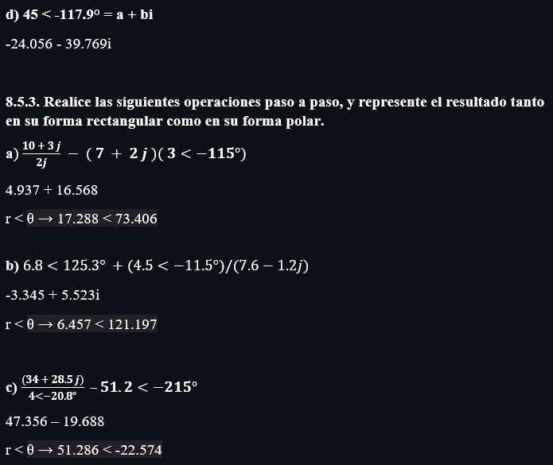

# Laboratorio-9

Integrantes: Acuña Marcelo, Robalino Johanna, Villacis Isaac 

**PRÁCTICA No. 9 FASORES**

**1. OBJETIVO DE LA PRÁCTICA**

* Objetivo General

* Estudiar conceptos básicos para la realización de operaciones aritméticas con números complejos, tanto en su forma polar como rectangular.

* Objetivos Específicos 

* Aplicar experimentalmente las leyes de conservación de energía eléctrica atravez de fasores.

* Usar cálculos algebraicos para la resolución de los ejercicios.

* Conocer la importancia y la aplicación de fasores en circuitos eléctricos de corrientealterna.

**2. MARCO TEORICO**

**3. MATERIALES**

  1 Calculadora Científica

**3. PROCEDIMIENTO**

**4. VIDEO**

https://youtu.be/smtynY4UDNA

**5. CONCLUCIONES**

*  En definitiva se trata de dar una pequeña introducción al uso de fasores, en problemas relacionados con la electricidad y la electrónica ya que de estos ejercicio podemos plantearlos de forma más simple para así conseguir el resultado.

**6. BIBLIOGRAFÍA**

•	*Ingeniería Mecafenix. (20 de Febrero de 2019). ¿Qué es un capacitor? y sus tipos. Obtenido de ¿Qué es un capacitor?: https://www.ingmecafenix.com/electronica/el-capacitor/

•	*MecatrónicaLATAM. (23 de Abril de 2021). Capacitor. Obtenido de https://www.mecatronicalatam.com/es/tutoriales/electronica/componentes-electronicos/capacitor/
